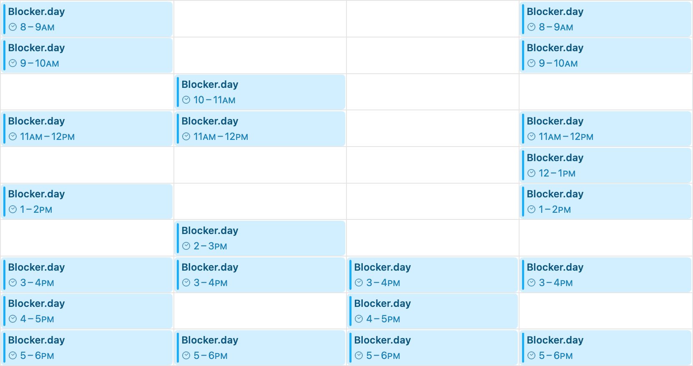

# Blocker.day

Blocker.day is a Cloudflare Worker that generates a unique `.ics` calendar feed of random (but deterministic) blocks of unavailable time.

Use Blocker.day to quickly populate an otherwise sparse calendar app, including Apple or Google; or randomly limit availability in a scheduling app, including [Cal.com](https://cal.com) and [SavvyCal](https://savvycal.com).

For example, Apple Calendar subscription to Blocker.day with 1 hour blocks and 50% probability: \
[blocker.day/calendar.ics?h=1&p=0.50](https://blocker.day/calendar.ics?h=1&p=0.50)

<picture style="max-width: 554px; width: 100%; display: block;">
  <source srcset="Calendar-app-dark.png" media="(prefers-color-scheme: dark)">
  <source srcset="Calendar-app-light.png" media="(prefers-color-scheme: light)">
  
</picture>

## Features

- generate a unique `.ics` calendar feed of unavailable time
- deterministic pseudo-random availability based on your seed value, probability, and time block
- time blocks begin each day at midnight (00:00) in the timezone specified

## Add or Subscribe

Add or subscribe to blocker.day in your calendar or scheduling app:

#### [blocker.day/calendar](https://blocker.day/calendar) <br />[blocker.day/calendar.ics](https://blocker.day/calendar.ics) <br /> [blocker.day/calendar.ics?days=7&hours=4&probability=0.35](https://blocker.day/calendar.ics?days=7&hours=4&probability=0.35)

The `.ics` file extension is optional. `DAYS`, `HOURS`, and `PROBABILITY` can be set in the URL query.

## Deploy

Deploy your own Cloudflare Worker to change additional settings (using [environment variables](#variables)) including `NAME`, `SEED`, `SEED_VIA_URL`, and `TIMEZONE`,

### Option 1: Deploy to Cloudflare

[](https://deploy.workers.cloudflare.com/?url=https://github.com/andesco/blocker.day)

### Option 2: Manual Deployment

1. Clone this repo:

```bash
git clone https://github.com/andesco/blocker.day.git
cd blocker.day
```

2. Customize default variables in `wrangler.toml` as needed. Example:

```toml wrangler.toml
DAYS = "21"
HOURS = "4"
PROBABILITY = "0.25"
TIMEZONE = "America/Vancouver"
```

3. Install Cloudflare’s Wrangler CLI, login, and deploy:

```bash
npm install -g wrangler
wrangler login
wrangler deploy
```

## Usage

Add or subscribe to a calendar using your worker subdomain, a custom subdomain, or blocker.day:
 
`https://appname.username.workers.dev/calendar.ics`

`https://subdomain.personal.com/calenda.ics`

`https://blocker.day/calendar.ics`

Calendar feeds generate consistent blocks of time based on the seed being used. To get a new set of randomized (but deterministic) blocks of time, update your Cloudflare Worker environment variables:

- change the default value of `SEED`; or
- set `SEED_VIA_URL` to `true` to set an optional per-calendar `SEED` when included in the URL query: `https://subdomain.personal.com/calendar?seed=random-seed-value`

 
 ## Variables
 
 ### Environment Variables
 
 | Variable      | Description                                  | Default   |
 |---------------|----------------------------------------------|-----------|
 | `DAYS`        | number of days: <br/> 1–21                   | `14` |
 | `HOURS`       | hours in each block of time: <br /> 0.5, 1, 2, 3, 4, 6, 8, 12, 24 | `3` |
 | `TIMEZONE`    | IANA timezone: <br/> [timezone identifier][wiki1] | `America/Toronto`   |
 | `NAME`        | calendar/event name displayed in apps        | `Blocker.day` |
 | `PROBABILITY` | probability of a time block: <br/> 0.00–1.00 | `0.50`    |
 | `SEED`        | default seed value                           | `default-seed-value` |
 | `SEED_VIA_URL`| set `SEED` using URL query (<br/>true, false     | `false`   |
 
### URL Query Parameters

 | Variable      | Description                                  |
 |---------------|----------------------------------------------|
 | `days` <br> `d`| number of days: <br/> 1–21                   |
 | `hours` <br> `h` | hours in each block of time: <br /> 0.5, 1, 2, 3, 4, 6, 8, 12, 24 | `3` |
 | `probability` <br> `p` | probability of a time block: <br/> 0.00–1.00 |
 | `seed` | calendar-specific seed value if `SEED_VIA_URL` is true


   [iana1]: https://www.iana.org/time-zones
   [wiki1]: https://en.wikipedia.org/wiki/List_of_tz_database_time_zones
  